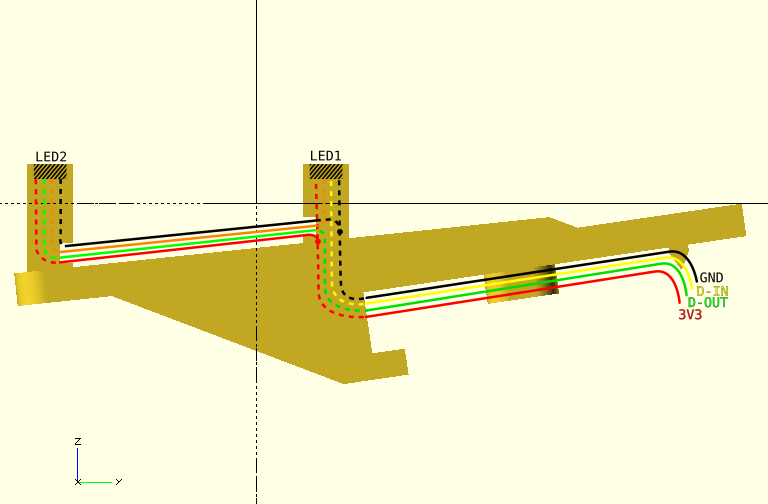

| notice | this project has moved to a new home: [`git.s-ol.nu/janko-keystep-rgb`](//git.s-ol.nu/janko-keystep-rgb). This github archive will however be kept up-to-date: If you want to browse it here, switch on over to the [`master`](//github.com/s-ol/janko-keystep-rgb/tree/master/) branch. |
| ------ | --- |

---

janko-keystep-rgb
=================
This is a modified version of [Tom Jensen's Arturia Keystep Janko Mod](https://www.thingiverse.com/thing:3564049),
which replaces the piano claviature with a hexagonal Janko grid.

This modification adds mouting holes and wiring channels to add 3535 RGB LEDs like the WS2812B-Mini under each key,
allowing to change the key coloring on-the-fly to reflect different scales and other information.

Status
------
The files and print are currently untested and may undergo some more revisions to work reliably.

Wiring
------
This picture shows the wiring for each individual key:

All keys should be daisy-chained together via Din/Dout, and share power.
Small-gauge, flexible wire (enamel copper) is recommended since the LED packages and pins are small.
